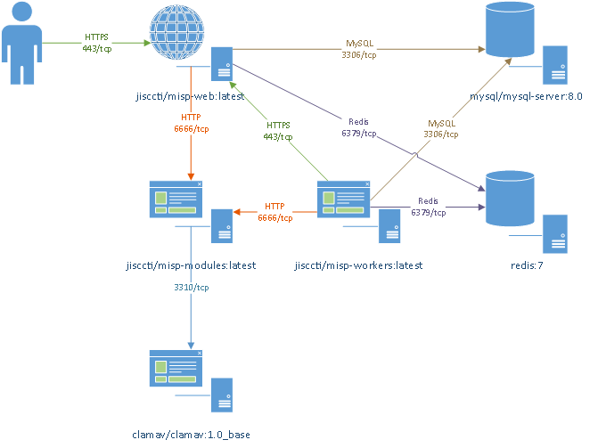

<!--
SPDX-FileCopyrightText: 2024 Jisc Services Limited
SPDX-FileContributor: James Ellor

SPDX-License-Identifier: GPL-3.0-only
-->

# Introduction

[)](https://github.com/MISP/MISP)

[)](https://github.com/MISP/misp-modules)

This guide will endeavour to walk through each of the steps required to deploy a customised and
fully operational MISP instance within Docker. It will also cover reasoning behind certain aspects
of the build and why specific choices were made.

***Note*** It is strongly advised that MISP is deployed in a dev environment until you are sure of
the use cases your organisation require MISP for, as it is extremely difficult to remove data from
MISP once it has been added. Therefore dev instances are a good idea before deploying into a
production environment.

## What is MISP?

From the official MISP GitHub; MISP is an open source software solution for collecting, storing,
distributing and sharing cyber security indicators and threats about cyber security incidents
analysis and malware analysis. MISP is designed by and for incident analysts, security and ICT
professionals or malware reversers to support their day-to-day operations to share structured
information efficiently.

Essentially, MISP is a tool used to share intelligence between people, whether that be people within
the same company, or between different companies or other entities, like Sharing/Trust Groups.

## Service Relationships

The below diagram shows how the services within this solution communicate.

